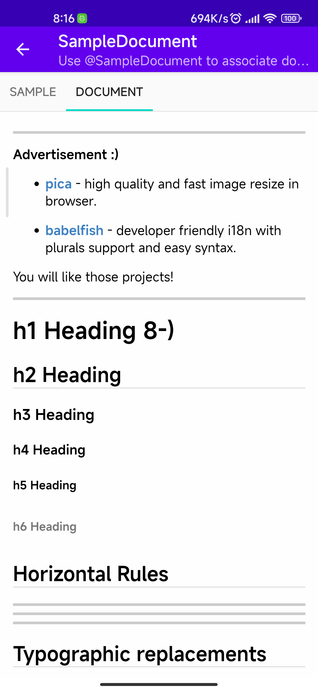
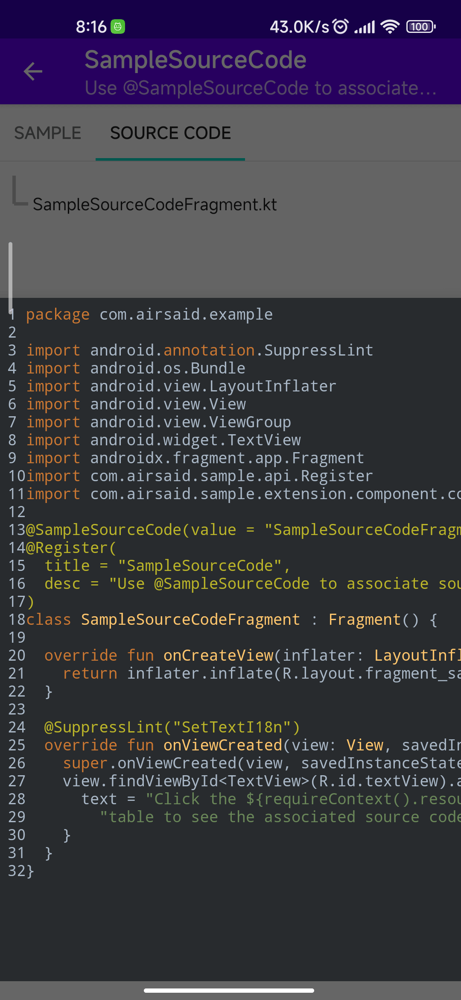
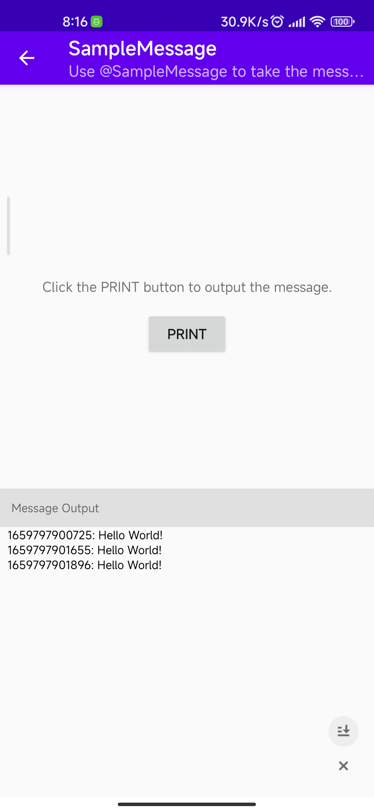
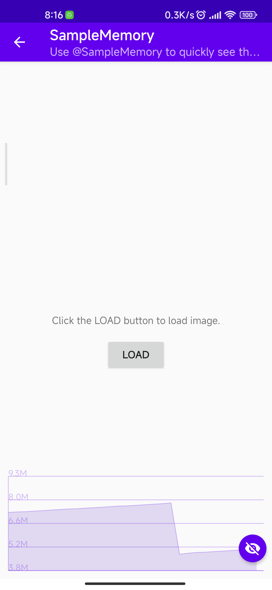

# sample-gradle-plugin

[](https://search.maven.org/artifact/com.airsaid/sample-plugin)
[](LICENSE)

:rocket: A powerful gradle plugin to help you demonstrate your android app.

We often have to write sample applications that contain a lot of boilerplate code, such as lists with jumps, fake data, etc.

SamplePlugin can automatically generate this template code through annotations and provide components for quick viewing of the documentation and source code on the application, etc. making it easier for people viewing the sample application to understand the sample.

# Minimal supported versions

Due to limited energy, the plugin currently supports only the current newer versions.

- Minimal supported [Gradle](https://www.gradle.org) version: `7.0.2`.
- Minimal supported [Android Gradle Plugin](https://developer.android.com/studio/releases/gradle-plugin) version: `7.0.0`.

# Setup
1. Add the following code to the root project `build.gradle.kts` file:
```kotlin
plugins {
  id("com.airsaid.sample") version "<latest_version>" apply false
}
```
2. Add the following code to the android application project `build.gradle.kts` file:
```kotlin
plugins {
  id("com.airsaid.sample")
}

dependencies {
  implementation("com.airsaid:sample-extension:<latest_version>")
}
```

<details>
<summary>Old setup method</summary>

1. Add the following code to the root project `build.gradle.kts` file:
```kotlin
buildscript {
  dependencies {
    classpath("com.airsaid:sample-gradle:<latest_version>")
  }
}
```

2. Add the following code to the android application project `build.gradle.kts` file:
```kotlin
plugins {
  id("com.airsaid.sample")
}

dependencies {
  implementation("com.airsaid:sample-extension:<latest_version>")
}
```
</details>

# How to use

Write your sample code in the `activity` or `fragment` and set the `@Register` annotation to the class to register.

For example:
```kotlin
@Register
class DemoFragment : Fragment() {
  ...
}
```
Then run the application and the item containing the sample page will appear in the list.

By default, we use the class name as the title of the item. Alternatively, the `@Register` annotation attributes can be used to set the title and description of the current item in the list.

For example:
```kotlin
@Register(title = "Demo", desc = "Demonstrate how to use.")
class DemoFragment : Fragment() {
  ...
}
```

For the organization of relationships between multiple sample, we use package names by default.

For example. this is your project structure:
```
com.airsaid.demo.fragment
    FragmentDemo1.kt
    FragmentDemo2.kt
com.airsaid.demo.ui
    ViewDemo1.kt
    ViewDemo2.kt
```

Your demo will look like this list:
```
|-- fragment
  |-- FragmentDemo1
  |-- FragmentDemo2
|-- ui
  |-- ViewDemo1
  |-- ViewDemo2
```
That's all, You don't need to do anything. Or you can specify it manually using the `path` attribute of the `@Register` annotation.

For example:
```kotlin
@Register(path = "android/view")
class DemoFragment : Fragment() {
  ...
}
```

## Working with testcase

Imagine you have a vast demonstration app, and finding one demo is hard. So you may want to open it directly whenever you launch your app.

The solution is to annotate your component with `@TestCase`:
```kotlin
@TestCase
@Register
class DemoFragment : Fragment() {
  ...
}
```

For more testcases I will help you pop up a dialog, and you can choose your demo.

## Working with extension

We provide a number of extension annotations to easily add additional demos to the sample.

For example, When you use `@SampleSourceCode,` it will help you generate a ViewPager and put your source code as a list:
```kotlin
@SampleSourceCode
@Register
class DemoFragment : Fragment() {
  ...
}
```

The following extension annotations are now supported.

### @SampleDocument

Display the related document. For example:
```kotlin
// You can specify the documents in the assets directory:
@SampleDocument("assets://sample_document.md")
// Or you can set up an online documentation address:
// @SampleDocument("https://raw.githubusercontent.com/Airsaid/sample-gradle-plugin/master/README.md")
// Or you can specify documents in any directory, e.g. under the same level as the current class:
// @SampleDocument("sample_document.md")
@Register(
  title = "SampleDocument",
  desc = "Use @SampleDocument to associate documents to sample."
)
class SampleDocumentFragment : Fragment() {
  ...
}
```


### @SampleSourceCode

Display the source file. For example:
```kotlin
// By default, all source classes of the package where the current class is located are displayed.
@SampleSourceCode
// Or you can use regular expressions that filter only the required classes:
// @SampleSourceCode("SampleSourceCodeFragment.kt")
@Register(
  title = "SampleSourceCode",
  desc = "Use @SampleSourceCode to associate source code to sample."
)
class SampleSourceCodeFragment : Fragment() {
  ...
}
```


### @SampleMessage

Display the test message. For example:
```kotlin
@SampleMessage
@Register(
  title = "SampleMessage",
  desc = "Use @SampleMessage to take the messages output by System.out " +
    "and display them on the page."
)
class SampleMessageFragment : Fragment() {
  ...
}
```


### @SampleMemory

Display the runtime memory. For example:
```kotlin
@SampleMemory
@Register(
  title = "SampleMemory",
  desc = "Use @SampleMemory to quickly see the current memory usage on the page."
)
class SampleMemoryFragment : Fragment() {
  ...
}
```


### @SamplePermission

Automatically request specified permissions. For example:
```kotlin
@SamplePermission(
  Manifest.permission.CAMERA,
  Manifest.permission.READ_EXTERNAL_STORAGE
)
@Register(
  title = "SamplePermission",
  desc = "Use @SamplePermission and specify the permissions to be requested to " +
    "automatically request permissions when the page is first opened."
)
class SamplePermissionFragment : Fragment() {

  override fun onActivityCreated(savedInstanceState: Bundle?) {
    super.onActivityCreated(savedInstanceState)
    addPermissionObserver { result ->
      if (result.granted) {
        Toast.makeText(context, "${result.name} Permission request successful!", Toast.LENGTH_SHORT).show()
      } else {
        Toast.makeText(context, "${result.name} Permission request failed!", Toast.LENGTH_SHORT).show()
      }
    }
  }
  ...
}
```

# Project structure

- **app**: the demo app.
- **sample-api**: common api for both library and plugin.
- **sample-core**: the core library. It supports the basic action processor and extension.
- **sample-extension**: based on the core. It helps us implements all the extensions, such as components and functions.
- **sample-plugin**: this Gradle Plugin helps us collect all the sample, testcases, extensions.


# License
```
Copyright 2022 Airsaid. https://github.com/airsaid

Licensed under the Apache License, Version 2.0 (the "License");
you may not use this file except in compliance with the License.
You may obtain a copy of the License at

   http://www.apache.org/licenses/LICENSE-2.0

Unless required by applicable law or agreed to in writing, software
distributed under the License is distributed on an "AS IS" BASIS,
WITHOUT WARRANTIES OR CONDITIONS OF ANY KIND, either express or implied.
See the License for the specific language governing permissions and
limitations under the License.
```
